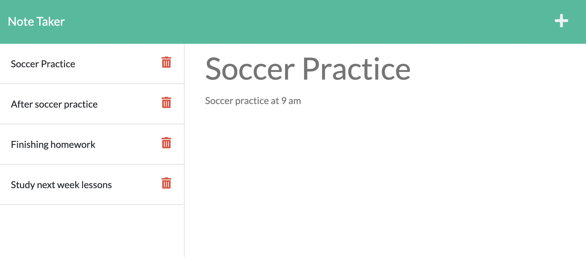

# Note Taker Starter Code

## Purpose
To create an application called Note Taker that allow the user to write note for today or future's plan that the user wants do.  It allows the user to delete or edit the note and make changes accordingly to the user's unforesee schedule and save the notes.  

## Built With
- HTML
- CSS
- JavaScript
- Node.js
- Express.js
- Deploy to Heroku

## Heroku Deploy Link
https://p-her.herokuapp.com/

## Github Link
https://github.com/p-her/note-taker

